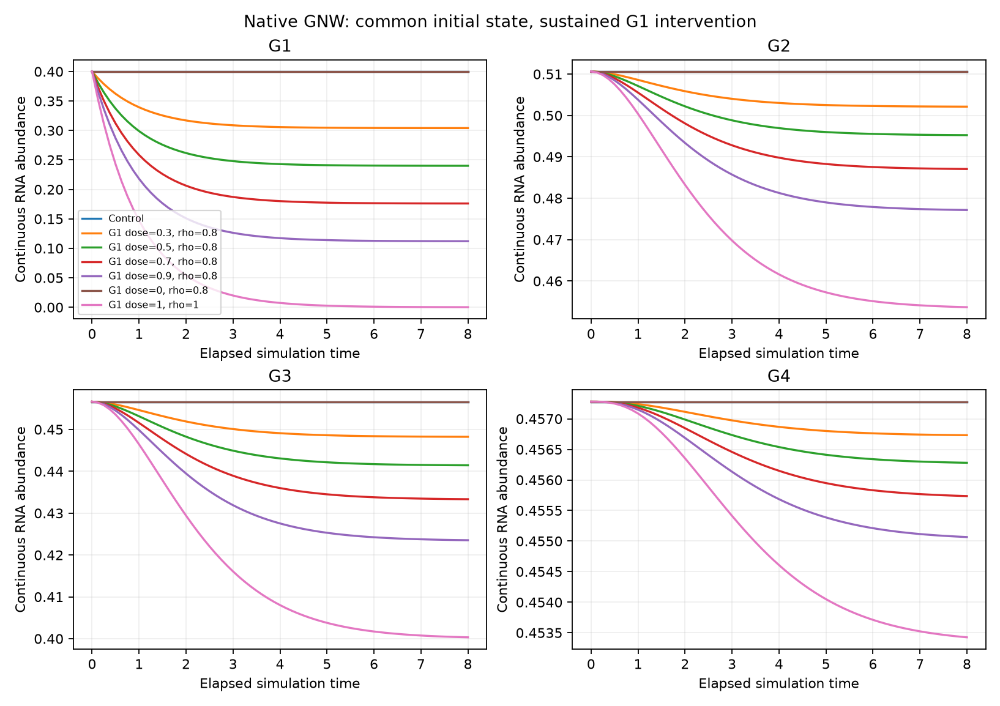
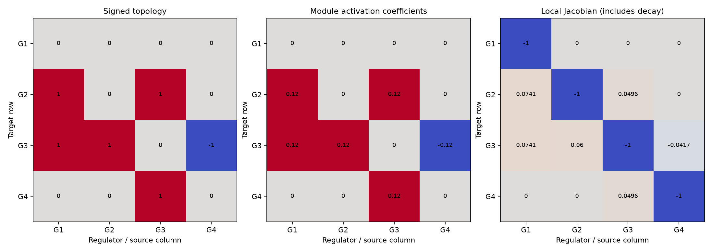

# Mac GNW 小网络适配验收：供 Windows 审查

本次结果用于决定下一步实验，不是冻结正式实验方案，也不是正式数据或模型训练结果。项目不引入 SNN（脉冲神经网络）。

## 先看结论

Mac 已通过官方 GNW（基因网络模拟器）原生 Java 模型和求解器完成一个固定 **4 基因、6 条有符号边**的小网络验收。**25/25 项专项检查通过**；项目测试 **55 项通过、46 项子测试通过**。这些测试数不是生物重复数或独立网络样本数。

原生适配路径可以继续开发，但**尚不是任意 GRN（基因调控网络）矩阵的通用导入器**。当前产生的是确定性、连续 RNA（核糖核酸）丰度，不是带生物异质性和测序噪声的单细胞计数数据。没有证据表明学习器已经能够恢复网络或预测真实细胞。

## 本次小网络与数据规模

- 边：G1→G2、G1→G3、G2→G3、G3→G2、G3→G4 为促进，G4→G3 为抑制；包含前馈、正反馈和负反馈。
- 行为被调控基因、列为调控基因；拓扑符号、模块作用系数、状态依赖的局部导数分别保存，不能混为一个矩阵。
- 明确关闭蛋白翻译层，避免当前 RNA 状态之外还有隐藏蛋白状态；关闭过程噪声和测量噪声，不裁剪负值，不做全数据归一化。
- 三个受控初态，每个有一个对照和四靶点×四剂量分支，再加零剂量和完全敲除验收，共 **53 条轨迹，每条 65 个时点、4 个基因**。
- 剂量为 0.3、0.5、0.7、0.9；同一靶点效率固定。扰动前 t=0 完全共用，随后仅缩放靶点产生项并持续到 t=8。时间是模拟单位，不等同于实际小时。
- 这些是**配对的模拟轨迹**，不是多个真实单细胞重复；此验收没有替换正式协议中的数据划分、预算或开放顺序。轨迹中重复保存 t=0 只用于核对，不改变正式共同基线只计一次的规则。
- 稳态独立延长积分求解，不能拿 t=8 代替。本次 t=8 最大变化速度残差仍为 `2.9264e-4`。

## 数值证据

| 核对 | Mac 最大误差或残差 |
| --- | --- |
| 原生变化速度和产生率 vs 独立模块概率重建 | 0（在本次探针上） |
| 原生 GNW 轨迹 vs 独立 SciPy 高精度积分 | 4.8969e-12 |
| 细化原生时钟与积分容差 | 4.1525e-12 |
| 单独求得稳态的变化速度残差 | 4.4132e-12 |
| 相同扰动条件不同初态的稳态差异 | 8.9611e-12 |

全部检查见 [中文报告](report.md) 和 [机器可读报告](report.json)。共享 JSON 保留版本、参数容差和文件校验值，但去掉本机绝对编译/运行路径；原始报告仍保留在 Mac 的忽略目录。

### 扰动传播轨迹

图为同一初态下持续敲低 G1 后全部四个基因的变化，包含零剂量与完全敲除验收。纵轴是连续丰度，各面板纵轴范围不同。

### 三种不同的矩阵

从左到右：输入符号拓扑、模块作用系数、在状态 `[0.4,0.5,0.6,0.7]` 下的局部导数。右图对角线的 -1 是降解项，不是自调控边。

## Windows 端请审查什么

1. **代码与数值**：检查 [Java 原生驱动](../../../tools/gnw/GnwAcceptance.java)、[运行器](../../../tools/gnw/run_acceptance.py) 和 [独立检查程序](../../../tools/gnw/check_acceptance.py)。若复跑，使用相同官方 GNW 程序包及校验值；不要修改验收阈值让失败通过。跨平台末位浮点数可能不同，Mac 的原始文件校验值用于审计，不作为 Windows 必须字节一致的要求；同机两次运行仍应一致。
2. **干预与时间语义**：复核 RNA-only（仅 RNA 状态）、t=0 共同基线、整数时钟变换时产生和降解率同时缩放、未知效率与名义强度区分、全程持续敲低、稳态另求。
3. **下一步生成器开发范围**：判断是否继续以 GNW 为主，先补任意小型 GRN 导入、非单位 Hill 系数、协同调控模块与更广参数范围，再扩大网络。当前受控 n=1 独立模块不能代表 GNW 的全部能力。
4. **训练数据难度**：决定是否先用完整配对轨迹检查有效动力学学习，再逐步增加初态差异、过程噪声、测序观测和不配对快照。若要改变冻结候选协议，须明确写出修订后再实施。
5. **两个研究问题的边界**：研究问题一不提供真实函数族、GRN、参数、局部导数或真实效率；研究问题二可以明确提供真实方程架构，但网络、强度、偏置、产生/降解、非线性及效率等未知参数均需列清，不只估计单个参数。

请返回：可直接沿用的部分、发现的问题、下一轮最小开发验收任务、需用户决定的实验取舍。**本轮审查不授权运行正式 24 基因/20 张盲测网络，也不授权训练正式模型。**

## 复现入口与环境

详见 [GNW 工具说明](../../../tools/gnw/README.md)。WSL（Windows 的 Linux 子系统）需使用 Linux x86_64 Java 17 开发环境，不能复制 Mac 的 arm64 运行环境；编译器与运行器都要可用。将 `--java-home` 与 `--gnw-jar` 替换为 Windows/WSL 的实际路径，并选择新的 `results/` 子目录。

本次 Mac 环境为 arm64、Java Temurin 17.0.20.1、Python 3.12.14；独立验收环境使用 NumPy 2.5.3、SciPy 1.18.1、Matplotlib 3.11.2。主项目依赖没有因这次验收改变。

GNW 官方来源提交：`c5310349f5d5723306585c2bb62aedbdeb70db46`；程序包 `gnw-3.1.2b.jar` 的 SHA256 校验值：

`b44ce5fcc95d1efc882d0da8a2b0428df4b175fbe4f0a836b4e66e120c08be5b`

本目录只共享报告和两张轻量图。原始轨迹、真值参数、日志、编译文件、程序包、虚拟环境和模型检查点不上传；其原始校验值保留在脱敏报告内，Windows 可在本地重新生成验收输出。
